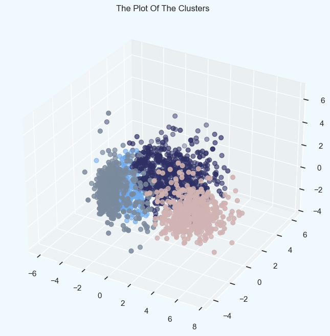

# Customer-Segmentation-Clustering

This project aims to use k-means and Agglomerative clustering to segment customers into different groups based on their characteristics and purchasing habits. The goal is to understand the similarities and differences between the customer segments, which can help inform marketing strategies and target specific groups of customers.

## Problem Statement

Customer Personality Analysis is a detailed analysis of a company’s ideal customers. It helps a business to better understand its customers and makes it easier for them to modify products according to the specific needs, behaviors and concerns of different types of customers.

Customer personality analysis helps a business to modify its product based on its target customers from different types of customer segments. For example, instead of spending money to market a new product to every customer in the company’s database, a company can analyze which customer segment is most likely to buy the product and then market the product only on that particular segment.

Content

## Attributes

People

ID: Customer's unique identifier
Year_Birth: Customer's birth year
Education: Customer's education level
Marital_Status: Customer's marital status
Income: Customer's yearly household income
Kidhome: Number of children in customer's household
Teenhome: Number of teenagers in customer's household
Dt_Customer: Date of customer's enrollment with the company
Recency: Number of days since customer's last purchase
Complain: 1 if the customer complained in the last 2 years, 0 otherwise
Products

MntWines: Amount spent on wine in last 2 years
MntFruits: Amount spent on fruits in last 2 years
MntMeatProducts: Amount spent on meat in last 2 years
MntFishProducts: Amount spent on fish in last 2 years
MntSweetProducts:Amount spent on sweets in last 2 years
MntGoldProds: Amount spent on gold in last 2 years
Promotion

NumDealsPurchases: Number of purchases made with a discount
AcceptedCmp1: 1 if customer accepted the offer in the 1st campaign, 0 otherwise
AcceptedCmp2: 1 if customer accepted the offer in the 2nd campaign, 0 otherwise
AcceptedCmp3: 1 if customer accepted the offer in the 3rd campaign, 0 otherwise
AcceptedCmp4: 1 if customer accepted the offer in the 4th campaign, 0 otherwise
AcceptedCmp5: 1 if customer accepted the offer in the 5th campaign, 0 otherwise
Response: 1 if customer accepted the offer in the last campaign, 0 otherwise
Place

NumWebPurchases: Number of purchases made through the company’s website
NumCatalogPurchases: Number of purchases made using a catalogue
NumStorePurchases: Number of purchases made directly in stores
NumWebVisitsMonth: Number of visits to company’s website in the last month
Data Preprocessing

Import the necessary libraries and load the dataset into a Pandas DataFrame.

## Handle missing values:

Identify any missing values in the dataset.
Decide on a strategy for handling missing values (e.g., dropping rows with missing values, imputing values using the mean or median). Here I am dropping using data.dropna().
Feature engineering:

To extract the age of a customer, I will create a new feature called Age using the Year_Birth column. This new feature will indicate the birth year of the customer, allowing me to easily calculate their age.
I will also create a feature called Spent that indicates the total amount of money that a customer has spent in various categories over the past two years.
In addition, I will create a new feature called "Living_With" that uses the Marital_Status column to determine whether couples are living together or not.
Another feature I will create is Children, which indicates the total number of children and teenagers in a household. This will allow me to get a better understanding of the size and composition of each household.
To further clarify the makeup of each household, I will also create a new feature called Family_Size that indicates the total number of people living in a household.
Additionally, I will create a feature called Is_Parent that indicates whether a customer is a parent or not. This will allow me to better understand the family dynamics of each household.
Finally, I will create three categories in the Education column by simplifying its value counts. This will make it easier to analyze and compare the education levels of different customers.
After creating these new features, I will drop any redundant columns that are no longer needed.

## Label Encoder

To preprocess the data for analysis, we will first convert any categorical features into numeric form using label encoding. Next, we will scale the features using the standard scaler to ensure that they are on the same scale. To improve the efficiency of the analysis, we can also create a subset of the data by selecting only a portion of the features to use. This process of dimensionality reduction can help improve the accuracy and efficiency of the analysis.

## PCA (Principle Component Analysis)

I will perform dimensionality reduction on the chosen features. This will involve reducing the number of features in the data set. By reducing the dimensions to 3, it will be easier to plot the data and observe any patterns or trends in the distribution of the features. I will then create a plot of the reduced data-frame to analyze the results of the dimensionality reduction.

## Clustering

To perform clustering on the data, I will use a method called Agglomerative clustering on the dataset that has been reduced to three dimensions. Agglomerative clustering is a type of hierarchical clustering that involves successively merging individual examples into clusters until the desired number of clusters is reached.

The process of clustering the data includes the following steps:

Using the Elbow Method to determine the optimal number of clusters to form.
Applying Agglomerative Clustering to the data to create the clusters.
Visualizing the resulting clusters using a scatter plot.
The Elbow Method is a technique used to determine the optimal number of clusters to form by plotting the sum of squared distances for each possible number of clusters and identifying the point of inflection, or "elbow," on the curve. This helps to identify the optimal number of clusters by choosing the number of clusters that minimizes the sum of squared distances. Once the optimal number of clusters has been determined, Agglomerative Clustering is applied to the data to create the clusters. Finally, the resulting clusters can be examined using a scatter plot to visualize the distribution of the data within each cluster.

## Elbow Method Visualization 

Elbow Method Visualization\

Based on the results of the Elbow Method, it appears that four clusters will be the optimal number for this dataset. Now, we will fit the Agglomerative Clustering model to the data to obtain the final clusters. This involves applying the Agglomerative Clustering algorithm to the data using the determined number of clusters. The resulting clusters will represent groups of data points that are similar to one another in some way.

## Result

### Below shows 4 clusters:

Cluster 0: It appears that the group being described consists of relatively older parents who have a family with a maximum of four members and at least two members. Many of these parents have a teenager at home, and some of them may be single parents. However, it is important to note that this is only a conclusion based on the information provided and may not be accurate in all cases. It is important to verify and confirm any information before making conclusions or decisions based on it.

Cluster 1: It appears that the group being described consists of non-parents who have a maximum of two members in their families. The majority of this group is made up of couples, rather than single individuals. The members of this group have a wide range of ages and are part of a high-income group. However, it is important to note that this is only a conclusion based on the information provided and may not be accurate in all cases. It is important to verify and confirm any information before making conclusions or decisions based on it.

Cluster 2: It appears that the group being described consists of relatively younger parents who have families with a maximum of three members. Most of these parents have one child, who is usually not a teenager. However, it is important to note that this is only a conclusion based on the information provided and may not be accurate in all cases. It is important to verify and confirm any information before making conclusions or decisions based on it.

Cluster4: It appears that the group being described consists of relatively older parents who have a family with a maximum of five members and at least two members. Many of these parents have a teenager at home, and they are part of a lower-income group. However, it is important to note that this is only a conclusion based on the information provided and may not be accurate in all cases. It is important to verify and confirm any information before making conclusions or decisions based on it.
